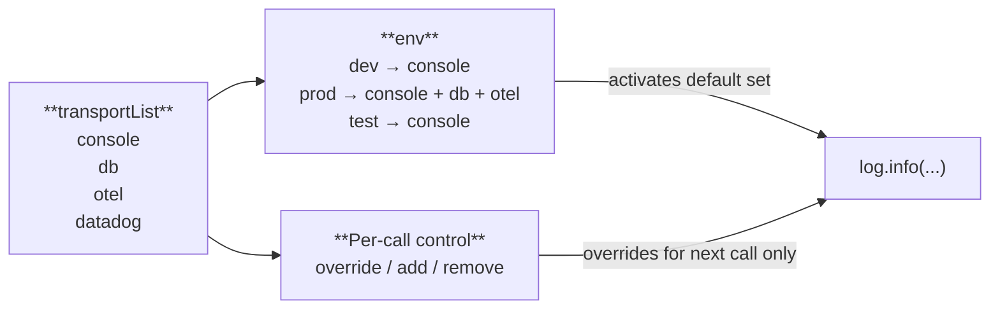

<p align="center">
  
</p>

<h1 align="center">SyntropyLog</h1>

<p align="center">
  <strong>The Observability Framework for High-Performance Teams.</strong>
  <br />
  Ship resilient, secure, and cost-effective Node.js applications with confidence.
</p>

# Example 03: TypeScript Context with Interfaces

This example demonstrates TypeScript-specific patterns: typed interfaces for context data, typed configuration, and typed logger usage. It also introduces the **two ways to configure transports** and what each one enables.

---

## 🎯 What You'll Learn

- **TypeScript interfaces** for context data (`UserContext`, `OrderData`)
- **Typed configuration** with `SyntropyLogConfig`
- **Two transport configuration approaches** — simple vs transport list
- **Per-call transport control** with `override`, `add`, `remove`

---

## 🚚 Two Ways to Configure Transports

### Way 1 — Direct `transports` (simple)

Pass transport instances directly. Every log call goes to all of them:

```typescript
syntropyLog.init({
  logger: {
    serviceName: 'my-app',
    transports: [new ClassicConsoleTransport(), new ConsoleTransport()],
  },
});
```

**Pros**: simple, zero boilerplate.
**Cons**: all transports always active, no per-call control, no environment routing.

This is what the current example uses.

---

### Way 2 — `transportList` + `env` (recommended)

Name each transport and declare which ones are active per environment. Transports can be **any backend** — console, database, OpenTelemetry, Datadog, Elasticsearch, S3, or any custom destination via `AdapterTransport`:

```typescript
syntropyLog.init({
  logger: {
    serviceName: 'my-app',
    transportList: {
      console:  new ClassicConsoleTransport(),
      db:       new AdapterTransport({ adapter: new UniversalAdapter({ executor: saveToPostgres }) }),
      otel:     new AdapterTransport({ adapter: new UniversalAdapter({ executor: sendToOtel }) }),
      datadog:  new AdapterTransport({ adapter: new UniversalAdapter({ executor: sendToDatadog }) }),
    },
    env: {
      development: ['console'],
      production:  ['console', 'db', 'otel'],
      test:        ['console'],
    },
    environment: process.env.NODE_ENV ?? 'development',
  },
});
```

**Pros**: environment routing, AND per-call control to any destination (see below).
**Cons**: a few extra lines at init.



---

## 🎛️ Per-Call Transport Control (transport list only)

Once you use `transportList`, every logger instance gains three fluent methods. Each one affects **only the next log call** — the following call goes back to the env default automatically.

### `override(...names)` — use ONLY these transports

```typescript
const log = syntropyLog.getLogger('order-service');

// This audit log goes ONLY to the database, bypassing console and otel
log.override('db').audit('Payment processed', { userId: 'u-42', amount: 299 });

// Back to env default (console + db + otel in production)
log.info('Order completed');
```

**Use case**: audit and compliance logs that must go to a specific store (DB, S3) regardless of what the environment default is.

---

### `add(...names)` — default set + extra

```typescript
// Default (console + db + otel) AND also sends to Datadog for this call
log.add('datadog').error('Payment gateway timeout', { provider: 'stripe' });
```

**Use case**: critical errors that need to reach an alerting platform (Datadog, PagerDuty) in addition to the normal destinations, without routing everything there.

---

### `remove(...names)` — default set minus one

```typescript
// Default minus 'db' — high-frequency trace log, no need to persist it
log.remove('db').debug('Cache lookup', { key: 'user:42', hit: true });
```

**Use case**: skip the database transport for noisy or cheap logs to reduce storage costs and write pressure.

---

### Chaining

You can chain `add` and `remove` in the same call:

```typescript
// Send to otel and datadog, but skip db for this one
log.add('datadog').remove('db').warn('Rate limit approaching', { userId: 'u-42' });
```

---

## 🏗️ TypeScript Interfaces in This Example

The example uses two interfaces to type the data flowing through the system:

```typescript
interface UserContext {
  userId: string;
  sessionId: string;
  correlationId: string;
  timestamp: string;
}

interface OrderData {
  orderId: string;
  productId: string;
  quantity: number;
  price: number;
}
```

### Named loggers + `child()` — bind context once

Each service has its own named logger (`service` field in output). `.child()` binds the relevant identifiers once so every log in that function carries them automatically — no repetition:

```typescript
function processOrder(orderData: OrderData, context: UserContext): void {
  const logger = syntropyLog.getLogger('order-service')
    .child({ orderId: orderData.orderId, userId: context.userId });

  logger.info('Processing order');                          // orderId + userId included
  logger.info('Order processed successfully', { totalPrice }); // orderId + userId + totalPrice
}

function validateOrder(orderData: OrderData, context: UserContext): boolean {
  const logger = syntropyLog.getLogger('validation-service')
    .child({ orderId: orderData.orderId, userId: context.userId });

  logger.info('Validating order');                          // different service name in output
  logger.warn('Order validation failed', { reason: '...' }); // orderId + userId + reason
}
```

Three different named loggers in this example (`main`, `order-service`, `validation-service`) — all sharing the same correlation ID from `AsyncLocalStorage`, each identified independently in the output.

The `SyntropyLogConfig` type gives full autocomplete on the init config:

```typescript
const config: SyntropyLogConfig = {
  logger: {
    level: 'info',
    serviceName: 'example-03-typescript',
    serializerTimeoutMs: 100,
    transports: [new ClassicConsoleTransport(), new ConsoleTransport()],
  },
  context: {
    correlationIdHeader: 'X-Correlation-ID',
  },
};
```

---

## 🚀 How to Run

```bash
cd 03-context-ts
npm install
npm run dev
```

### Expected output

```
🚀 Initializing SyntropyLog...
✅ SyntropyLog initialized successfully!
INFO  [main] Starting TypeScript context propagation example...
INFO  [main] Starting order processing session { orderId: 'ORD-001', correlationId: 'corr-ORD-001-...' }
INFO  [order-service] Processing order with TypeScript context { orderId: 'ORD-001', userId: 'user-...', correlationId: '...' }
INFO  [validation-service] Validating order with TypeScript context { orderId: 'ORD-001', ... }
INFO  [validation-service] Order validation passed { orderId: 'ORD-001', ... }
INFO  [order-service] Order processed successfully { orderId: 'ORD-001', totalPrice: 51, ... }
INFO  [main] Order processing completed successfully { orderId: 'ORD-001', ... }
...
INFO  [main] All orders processed. TypeScript example completed.
🔄 Shutting down SyntropyLog gracefully...
✅ SyntropyLog shutdown completed
```

---

## 🔗 Related Examples

- [Example 02](../02-basic-context) — context propagation without TypeScript
- [Example 09](../09-all-transports) — full `transportList` / `override` / `add` / `remove` demo
- [Example 07](../07-logger-configuration) — pretty vs JSON configuration
