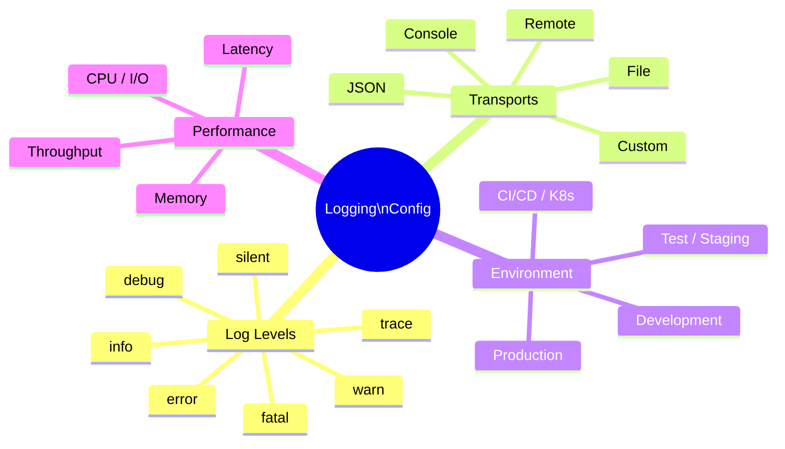

<p align="center">
  
</p>

<h1 align="center">SyntropyLog</h1>

<p align="center">
  <strong>The Observability Framework for High-Performance Teams.</strong>
  <br />
  Ship resilient, secure, and cost-effective Node.js applications with confidence.
</p>

# Example 04: Logging Levels and Transports 📊

> **Core Framework Feature** - Understanding SyntropyLog's logging levels and transport options for different environments.

## 🎯 What You'll Learn

This example demonstrates SyntropyLog's logging system fundamentals:

- **Logging levels**: fatal, error, warn, info, debug, trace, silent
- **Transport options**: Console, JSON transports
- **Environment-specific logging**: Development vs Production
- **Simple configuration**: How to configure logging for different needs

## 🏗️ Architecture Overview


```

## 🎯 Learning Objectives

### **Logging Levels:**
- **When to use each level** and why
- **Performance impact** of different levels
- **Production vs Development** level strategies
- **Level filtering** and configuration

### **Transport Options:**
- **Console transports**: Human-readable vs JSON
- **Custom transports**: Creating your own
- **Multiple transports**: Using different outputs simultaneously
- **Conditional transports**: Environment-based selection

### **Environment Strategies:**
- **Development**: Verbose logging for debugging
- **Production**: Minimal logging for performance
- **Testing**: Structured logging for automation
- **Staging**: Balanced approach

### **Simple Configuration:**
- **Development logging**: Verbose logging for debugging
- **Production logging**: Minimal logging for performance
- **Environment detection**: Automatic configuration based on environment
- **Transport selection**: Choosing the right transport for your needs

## 🚀 Implementation Plan

### **Phase 1: Basic Levels**
- [ ] Configure all logging levels
- [ ] Demonstrate level filtering
- [ ] Show performance differences

### **Phase 2: Transport Options**
- [ ] Console transport (pretty vs JSON)
- [ ] Custom transport implementation
- [ ] Multiple transports configuration

### **Phase 3: Environment Strategies**
- [ ] Development configuration
- [ ] Production configuration
- [ ] Environment-based selection

### **Phase 4: Environment Strategies**
- [ ] Development configuration
- [ ] Production configuration
- [ ] Environment-based selection

## 📊 Expected Outcomes

### **Technical Demonstrations:**
- ✅ **All logging levels** working correctly
- ✅ **Multiple transport options** configured
- ✅ **Environment-specific** logging strategies
- ✅ **Simple configuration** patterns

### **Learning Outcomes:**
- ✅ **When to use which level** for different scenarios
- ✅ **How to configure transports** for different needs
- ✅ **Environment-based** configuration strategies
- ✅ **Simple best practices** for logging

## 🎯 Example Output

When you run this example, you'll see structured logging output like this:

### **❌ DEFAULT (JSON Format - Production):**

```json
{"x-correlation-id-test-04":"8c0a18e3-4870-4cea-93d0-f386884c7b70","operation":"logging-demo","userId":"demo-user-123","level":"info","timestamp":"2025-07-21T23:32:11.102Z","service":"main-application","message":"🚀 Starting logging levels demonstration..."}
{"x-correlation-id-test-04":"8c0a18e3-4870-4cea-93d0-f386884c7b70","operation":"logging-demo","userId="demo-user-123","level":"fatal","timestamp":"2025-07-21T23:32:11.102Z","service":"main-application","message":"Application is shutting down due to critical error { error: 'Database connection lost', impact: 'All services affected' }"}
{"x-correlation-id-test-04":"8c0a18e3-4870-4cea-93d0-f386884c7b70","operation":"logging-demo","userId":"demo-user-123","level":"error","timestamp":"2025-07-21T23:32:11.103Z","service":"user-service","message":"Failed to process user request {\n  userId: 'user-123',\n  operation: 'payment-processing',\n  error: 'Payment gateway timeout'\n}"}
```

### **✅ ClassicConsoleTransport (Spring Boot Style - Development):**

```bash
2025-07-21 20:30:20 INFO  [main-application] [x-correlation-id-test-04="eed46dbf-be69-48e1-a48a-af03cc6adc1f" operation="logging-demo" userId="demo-user-123" message="🚀 Starting logging levels demonstration..."]
2025-07-21 20:30:20 FATAL [main-application] [x-correlation-id-test-04="eed46dbf-be69-48e1-a48a-af03cc6adc1f" operation="logging-demo" userId="demo-user-123" message="Application is shutting down due to critical error { error: 'Database connection lost', impact: 'All services affected' }"]
2025-07-21 20:30:20 ERROR [user-service] [x-correlation-id-test-04="eed46dbf-be69-48e1-a48a-af03cc6adc1f" operation="logging-demo" userId="demo-user-123" message="Failed to process user request {\n  userId: 'user-123',\n  operation: 'payment-processing',\n  error: 'Payment gateway timeout'\n}"]
```

### **Key Features Demonstrated:**
- ✅ **Correlation ID** automatically included in all logs (`x-correlation-id-test-04`)
- ✅ **Context preservation** across all log levels (`operation`, `userId`)
- ✅ **Multiple services** with same correlation ID (`main-application`, `user-service`, `database-connection`, `authentication-middleware`)
- ✅ **ClassicConsoleTransport** format (Spring Boot style) for development
- ✅ **Structured data** with metadata
- ✅ **Timestamp precision** with readable format

## ⚠️ **IMPORTANT: Context Management in Examples**

### **🔍 Why Context is Manual in Examples**

In SyntropyLog, **context management is asynchronous** and uses Node.js `AsyncLocalStorage`. This means:

1. **Context is NOT global by default** - it only exists within `contextManager.run()` blocks
2. **Examples are quick demonstrations** - they don't have HTTP requests or message queues that automatically create context
3. **Manual context creation** - we must wrap our logging operations in `contextManager.run()` to get correlation IDs

### **🎯 The Solution: Global Context Wrapper**

```typescript
// ❌ WITHOUT context (no correlationId)
mainLogger.info('Starting...'); // No correlationId

// ✅ WITH context (has correlationId)
await contextManager.run(async () => {
  mainLogger.info('Starting...'); // Has correlationId automatically
  userLogger.error('Error...');   // Has correlationId automatically
  paymentLogger.info('Payment...'); // Has correlationId automatically
});
```

### **🔮 The Magic Middleware (2 Lines of Code)**

In production applications, you'll use this simple middleware:

```typescript
app.use(async (req, res, next) => {
  await contextManager.run(async () => {
    // 🎯 MAGIC: Just 2 lines!
    const correlationId = contextManager.getCorrelationId(); // Detects or generates
    contextManager.set(contextManager.getCorrelationIdHeaderName(), correlationId); // Sets in context
    
    next();
  });
});
```

**Why this is marvelous:**
- **Intelligent Detection**: `getCorrelationId()` uses existing ID or generates new one
- **Automatic Configuration**: `getCorrelationIdHeaderName()` reads your config
- **Automatic Propagation**: Once set, it propagates to all logs and operations

### **🚀 In Real Applications**

In production applications, context is automatically created by:
- **HTTP middleware** (Express, Fastify, etc.)
- **Message queue handlers** (Kafka, RabbitMQ, etc.)
- **Background job processors**
- **API gateways**

### **📚 Key Takeaway**

**For examples and quick tests**: Wrap all logging in `contextManager.run()`  
**For production apps**: Use SyntropyLog's HTTP/broker adapters for automatic context

---

## 🔧 Prerequisites

- Node.js 18+
- Understanding of basic logging concepts
- Familiarity with examples 00-03 (basic setup)

## 📝 Notes for Implementation

- **Start simple**: Basic level configuration first
- **Add complexity gradually**: One transport at a time
- **Focus on practical use**: Show real scenarios
- **Document simple patterns**: Explain when to use what
- **Environment examples**: Show dev vs prod configurations

---

**Status**: ✅ **COMPLETE** - This example demonstrates SyntropyLog's logging fundamentals with working, tested code. 