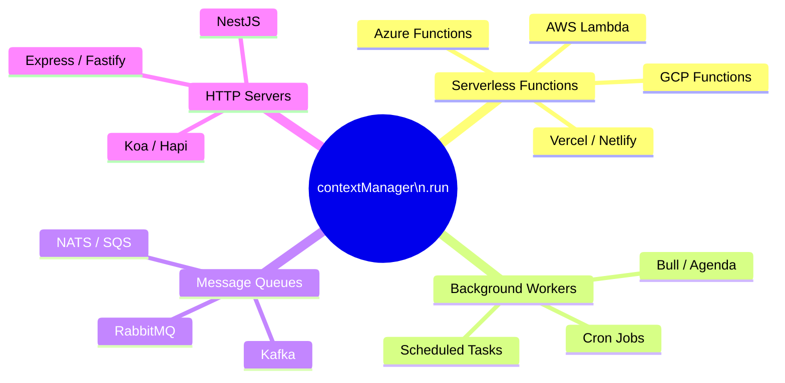

<p align="center">
  
</p>

<h1 align="center">SyntropyLog</h1>

<p align="center">
  <strong>The Observability Framework for High-Performance Teams.</strong>
  <br />
  Ship resilient, secure, and cost-effective Node.js applications with confidence.
</p>

# Example 05: Universal Context Patterns 🌐

> **Conceptual Reference** - Understanding how SyntropyLog's context management works across ALL types of Node.js applications, not just HTTP servers.

## 🎯 What You'll Learn

This example demonstrates SyntropyLog's universal context patterns:

- **Serverless Functions**: AWS Lambda, Google Cloud Functions, Azure Functions
- **Background Workers**: Bull, Agenda, cron jobs, scheduled tasks
- **Message Queue Handlers**: Kafka, RabbitMQ, NATS consumers
- **HTTP Servers**: Express, Fastify, Koa, Hapi
- **Universal Pattern**: Same context management for ALL application types

## 🏗️ Architecture Overview


```

## 🎯 Learning Objectives

### **Serverless Functions:**
- **AWS Lambda**: Event-driven, stateless functions
- **Google Cloud Functions**: Serverless compute platform
- **Azure Functions**: Event-driven serverless compute
- **Vercel/Netlify**: Edge functions and serverless

### **Background Workers:**
- **Bull/Agenda**: Job queues and scheduling
- **Cron Jobs**: Scheduled tasks and automation
- **Worker Threads**: CPU-intensive background processing
- **Task Queues**: Asynchronous task processing

### **Message Queue Handlers:**
- **Kafka**: Event streaming and messaging
- **RabbitMQ**: Message broker and routing
- **NATS**: Lightweight messaging system
- **SQS/Pub-Sub**: Cloud message queues

### **HTTP Servers:**
- **Express/Fastify**: Web application frameworks
- **Koa/Hapi**: Alternative web frameworks
- **NestJS**: Enterprise Node.js framework
- **Adapters**: Framework-agnostic HTTP handling

### **Universal Pattern:**
- **Same Context Management**: Identical pattern for ALL application types
- **Correlation ID Detection**: Automatic detection or generation
- **Context Propagation**: Automatic propagation across all operations
- **Framework Agnostic**: Works with any Node.js application

## 🚀 Implementation Plan

### **Phase 1: Serverless Functions (Conceptual)**
- [x] AWS Lambda handler pattern simulation
- [x] Google Cloud Functions pattern simulation
- [x] Azure Functions pattern simulation
- [x] Vercel/Netlify functions pattern simulation

### **Phase 2: Background Workers (Conceptual)**
- [x] Bull job processor pattern simulation
- [x] Agenda scheduled job pattern simulation
- [x] Cron job pattern simulation
- [x] Worker thread pattern simulation

### **Phase 3: Message Queue Handlers (Conceptual)**
- [x] Kafka consumer pattern simulation
- [x] RabbitMQ consumer pattern simulation
- [x] NATS subscriber pattern simulation
- [x] SQS message handler pattern simulation

### **Phase 4: HTTP Servers (Conceptual)**
- [x] Express middleware pattern simulation
- [x] Fastify plugin pattern simulation
- [x] Koa middleware pattern simulation
- [x] Hapi plugin pattern simulation

### **Phase 5: Universal Pattern Demonstration**
- [x] Same context code across all types
- [x] Correlation ID detection patterns
- [x] Context propagation verification
- [x] Cross-platform compatibility

## 📊 Expected Outcomes

### **Technical Demonstrations:**
- ✅ **Serverless functions** with context management (conceptual patterns)
- ✅ **Background workers** with context propagation (conceptual patterns)
- ✅ **Message queue handlers** with context correlation (conceptual patterns)
- ✅ **HTTP servers** with context middleware (conceptual patterns)
- ✅ **Universal pattern** working across all platforms

### **Learning Outcomes:**
- ✅ **Same context code** works in ANY Node.js application
- ✅ **Correlation ID detection** in different environments
- ✅ **Context propagation** across all application types
- ✅ **Framework agnostic** context management
- ✅ **Universal observability** patterns

### **Reference Value:**
- 📚 **Conceptual reference** for implementing in real applications
- 🎯 **Pattern templates** for different application types
- 🔍 **Understanding** of how context works universally
- 💡 **Foundation** for building real integrations

## 🔧 Prerequisites

- Node.js 18+
- Understanding of basic context concepts
- Familiarity with examples 00-04 (basic setup and logging)
- Basic knowledge of different Node.js application types

## 📝 Notes for Implementation

- **Conceptual Example**: This example demonstrates patterns, not real integrations
- **Real Integrations**: See the main repo README for the full list of examples
- **Pattern Reference**: Use this as a template for your own implementations
- **Universal Concept**: Same context code works in any Node.js application
- **Correlation ID**: Automatic detection and propagation in all environments
- **Framework Agnostic**: Context management works with any technology

## ⚠️ **IMPORTANT: Context Management in Examples**

### **🔍 Why Context is Manual in Examples**

In SyntropyLog, **context management is asynchronous** and uses Node.js `AsyncLocalStorage`. This means:

1. **Context is NOT global by default** - it only exists within `contextManager.run()` blocks
2. **Examples are quick demonstrations** - they don't have HTTP requests or message queues that automatically create context
3. **Manual context creation** - we must wrap our logging operations in `contextManager.run()` to get correlation IDs

### **🎯 The Solution: Global Context Wrapper**

```typescript
// ❌ WITHOUT context (no correlationId)
logger.info('Configuration loaded'); // No correlationId

// ✅ WITH context (has correlationId)
await contextManager.run(async () => {
  logger.info('Configuration loaded'); // Has correlationId automatically
});
```

### **🔮 The Magic Middleware (2 Lines of Code)**

In production applications, you'll use this simple middleware:

```typescript
app.use(async (req, res, next) => {
  await contextManager.run(async () => {
    // 🎯 MAGIC: Just 2 lines!
    const correlationId = contextManager.getCorrelationId(); // Detects or generates
    contextManager.set(contextManager.getCorrelationIdHeaderName(), correlationId); // Sets in context
    
    next();
  });
});
```

**Why this is marvelous:**
- **Intelligent Detection**: `getCorrelationId()` uses existing ID or generates new one
- **Automatic Configuration**: `getCorrelationIdHeaderName()` reads your config
- **Automatic Propagation**: Once set, it propagates to all logs and operations

### **🚀 In Real Applications**

In production applications, context is automatically created by:
- **HTTP middleware** (Express, Fastify, etc.)
- **Message queue handlers** (Kafka, RabbitMQ, etc.)
- **Background job processors**
- **API gateways**

### **📚 Key Takeaway**

**For examples and quick tests**: Wrap all logging in `contextManager.run()`  
**For production apps**: Use SyntropyLog's HTTP/broker adapters for automatic context

## 🎯 Example Output

When you run this example, you'll see the SAME context pattern working across different application types:

### **🌐 Serverless Function (AWS Lambda):**
```json
{"level":"info","timestamp":"2025-07-21T23:30:20.545Z","service":"lambda-handler","x-correlation-id":"550e8400-e29b-41d4-a716-446655440000","message":"Processing Lambda event","eventType":"S3","bucket":"my-bucket"}
```

### **⚙️ Background Worker (Bull):**
```json
{"level":"info","timestamp":"2025-07-21T23:30:20.545Z","service":"payment-worker","x-correlation-id":"550e8400-e29b-41d4-a716-446655440000","message":"Processing payment job","jobId":"job-123","amount":99.99}
```

### **📨 Message Queue (Kafka):**
```json
{"level":"info","timestamp":"2025-07-21T23:30:20.545Z","service":"order-consumer","x-correlation-id":"550e8400-e29b-41d4-a716-446655440000","message":"Processing order message","orderId":"order-456","customerId":"cust-789"}
```

### **🌐 HTTP Server (Express):**
```json
{"level":"info","timestamp":"2025-07-21T23:30:20.545Z","service":"api-server","x-correlation-id":"550e8400-e29b-41d4-a716-446655440000","message":"Processing HTTP request","method":"POST","path":"/api/orders"}
```

**Notice: The SAME correlation ID pattern works across ALL application types!**

---

**Status**: ✅ **Complete** - This example demonstrates SyntropyLog's universal context patterns as a conceptual reference for ALL Node.js application types. 