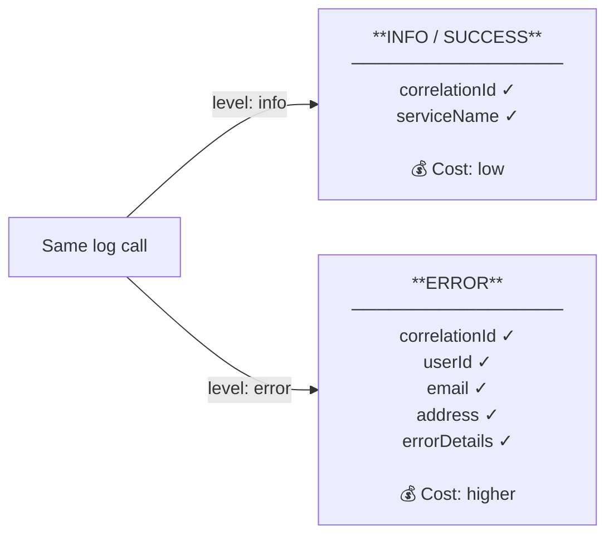

<p align="center">
  
</p>

<h1 align="center">SyntropyLog</h1>

<p align="center">
  <strong>The Observability Framework for High-Performance Teams.</strong>
  <br />
  Ship resilient, secure, and cost-effective Node.js applications with confidence.
</p>

# Example 08: Logging Matrix 🧮

> **Simple Concept** - Control what information appears in your logs to save costs and improve debugging.

## 🎯 What You'll Learn

This example demonstrates SyntropyLog's logging matrix:

- **Cost control**: Keep success logs lean and cheap
- **Smart defaults**: Minimal info, full context on errors
- **Declarative control**: Define exactly what gets logged
- **Flexible configuration**: Customize to your needs

## 🏗️ Simple Concept



## 🎯 Learning Objectives

### **Cost Control:**
- **Success logs**: Minimal information, low cost
- **Error logs**: Complete context, worth the cost
- **Smart defaults**: Good starting point
- **Customizable**: Full control over what appears

### **Smart Defaults:**
- **INFO**: correlationId, serviceName (minimal)
- **WARNING**: correlationId, userId, errorCode (important)
- **ERROR**: Everything (*) (complete context)
- **DEBUG**: Everything (*) (full details)

### **Real-World Usage:**
- **Production**: Control log ingestion costs
- **Development**: Full context for debugging
- **Compliance**: Complete audit trail for errors
- **Performance**: Faster logging with minimal context

## 🚀 Implementation Plan

### **Phase 1: Default Behavior**
- [x] Show default logging matrix
- [x] Demonstrate minimal vs complete logs
- [x] Explain cost implications

### **Phase 2: Custom Configuration**
- [x] Custom logging matrix
- [x] Different fields per level
- [x] Show flexibility

### **Phase 3: Real-World Example**
- [x] User request processing
- [x] Success vs error scenarios
- [x] Cost comparison

## 📊 Expected Outcomes

### **What You'll See:**
- ✅ **Default behavior**: Minimal info for success, complete for errors
- ✅ **Custom configuration**: Your own field selection
- ✅ **Cost control**: Different information per level
- ✅ **Flexibility**: Complete customization

### **What You'll Learn:**
- ✅ **Smart defaults** save money and time
- ✅ **Error logs** get complete context automatically
- ✅ **Success logs** stay lean and cheap
- ✅ **Full control** over what information appears

## 🔧 Prerequisites

- Node.js 18+
- Understanding of examples 00-07 (basic concepts)
- Basic knowledge of log costs and debugging

## 📝 Notes for Implementation

- **Keep it simple**: Show defaults vs customization
- **Focus on costs**: Explain why this matters
- **Show flexibility**: Complete control over configuration
- **Real-world value**: Production-ready patterns

## ⚠️ **IMPORTANT: Context Management in Examples**

### **🔍 Why Context is Manual in Examples**

In SyntropyLog, **context management is asynchronous** and uses Node.js `AsyncLocalStorage`. This means:

1. **Context is NOT global by default** - it only exists within `contextManager.run()` blocks
2. **Examples are quick demonstrations** - they don't have HTTP requests or message queues that automatically create context
3. **Manual context creation** - we must wrap our logging operations in `contextManager.run()` to get correlation IDs

### **🎯 The Solution: Global Context Wrapper**

```typescript
// ❌ WITHOUT context (no correlationId)
logger.info('User logged in'); // No correlationId

// ✅ WITH context (has correlationId)
await contextManager.run(async () => {
  logger.info('User logged in'); // Has correlationId automatically
});
```

### **🔮 The Magic Middleware (2 Lines of Code)**

In production applications, you'll use this simple middleware:

```typescript
app.use(async (req, res, next) => {
  await contextManager.run(async () => {
    // 🎯 MAGIC: Just 2 lines!
    const correlationId = contextManager.getCorrelationId(); // Detects or generates
    contextManager.set(contextManager.getCorrelationIdHeaderName(), correlationId); // Sets in context
    
    next();
  });
});
```

**Why this is marvelous:**
- **Intelligent Detection**: `getCorrelationId()` uses existing ID or generates new one
- **Automatic Configuration**: `getCorrelationIdHeaderName()` reads your config
- **Automatic Propagation**: Once set, it propagates to all logs and operations

### **🚀 In Real Applications**

In production applications, context is automatically created by:
- **HTTP middleware** (Express, Fastify, etc.)
- **Message queue handlers** (Kafka, RabbitMQ, etc.)
- **Background job processors**
- **API gateways**

### **📚 Key Takeaway**

**For examples and quick tests**: Wrap all logging in `contextManager.run()`  
**For production apps**: Use SyntropyLog's HTTP/broker adapters for automatic context

## 🎯 Example Output

When you run this example, you'll see how the same log call produces different information based on the log level:

### **🌞 Success Log (INFO) - Minimal Configuration:**
```
12:56:00 [INFO] (logging-matrix-demo): User request processed successfully { status: 'completed', duration: '150ms' }
{
  "userId": 123,
  "operation": "user-login"
}
```

### **🏭 Error Log (ERROR) - Complete Context:**
```
12:56:00 [INFO] (logging-matrix-demo): User request processed successfully { status: 'completed', duration: '150ms' }
{
  "userId": 123,
  "email": "user@example.com",
  "password": "secret123",
  "firstName": "John",
  "lastName": "Doe",
  "address": "123 Main St, New York, NY",
  "phone": "+1-555-0123",
  "ipAddress": "192.168.1.1",
  "userAgent": "Mozilla/5.0 (Windows NT 10.0; Win64; x64) AppleWebKit/537.36",
  "sessionId": "sess-789",
  "requestId": "req-456",
  "preferences": {
    "theme": "dark",
    "language": "en"
  },
  "metadata": {
    "source": "web",
    "version": "1.0"
  },
  "operation": "user-login"
}
```

### **🎯 Key Insight:**
**Same log call, different information!** This demonstrates:

- **Cost control**: Success logs are lean and cheap (only 2 fields)
- **Complete debugging**: Error logs have all the context (15+ fields)
- **Smart defaults**: Good starting point for most applications
- **Full customization**: You can change everything dynamically
- **Hot configuration**: `reconfigureLoggingMatrix()` works seamlessly

## 🔒 Security & Compliance Notice

### **✅ Safe Dynamic Changes:**
- **Logging Matrix**: Controls which context fields appear in logs
- **Log Level**: Can be changed dynamically (trace, debug, info, warn, error, fatal)
- **Masking Fields**: Can add new sensitive fields dynamically (additive only)

### ** Immutable Configuration:**
- **Transports**: Cannot be changed dynamically (console, file, remote services)
- **Security Settings**: Core masking config (maskChar, maxDepth, style) cannot be modified
- **Infrastructure**: Redis, HTTP, and broker configurations cannot be modified

### **🎯 Compliance Guarantee:**
- **GDPR/HIPAA**: Sensitive data remains masked regardless of any dynamic changes
- **Audit Trail**: All security configurations are logged and immutable
- **Zero Risk**: Dynamic changes only affect log verbosity, level, and additive masking
- **Workaround**: New sensitive fields can be added without redeployment

**This saves money and improves debugging!** In production:
- **Success logs**: Minimal cost, essential information
- **Error logs**: Worth the cost, complete context for debugging
- **Custom control**: Define exactly what matters for your application

---

**Status**: ✅ **Complete** - This example demonstrates how to control log information and costs with SyntropyLog's logging matrix. 