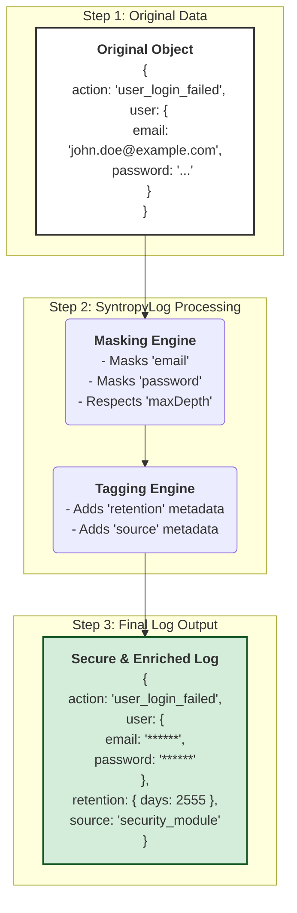

# Example 90: Compliance, Masking, and Performance

This example demonstrates how to configure **SyntropyLog** to meet compliance requirements by automatically masking sensitive data, and how to handle performance considerations for deeply nested objects.

## Concepts

In many applications, especially those handling user data, there are legal and ethical requirements (like GDPR, HIPAA, etc.) to prevent sensitive Personally Identifiable Information (PII) from being stored in logs.

**SyntropyLog** provides a powerful, centralized masking engine to automatically find and redact sensitive data before it's written to any transport. However, recursively scanning very large or deeply nested objects can impact performance. To prevent this, the engine has a built-in safety mechanism: `maxDepth`.

## What This Example Shows

This simple, single-service example will show how to:

1.  **Configure the global masking engine:** We will define a set of sensitive field names, including dot-notation for nested fields (e.g., `email`, `password`, `address.street`).
2.  **Set a custom `maxDepth`:** We will override the default recursion depth to control how deep the engine scans for sensitive data.
3.  **Log a complex, deeply nested object:** We will log an object that contains sensitive data at different nesting levels.
4.  **Verify the output:** We will observe how fields within the `maxDepth` limit are correctly masked, while a sensitive field placed *beyond* this limit remains unmasked.

### An Important Note on `maxDepth` and Developer Responsibility

The `maxDepth` feature is a critical safeguard against performance degradation and infinite recursion in circular objects. The default value is a sensible starting point, but it is **not a silver bullet**.

It is the developer's responsibility to understand their data structures. If you handle objects where sensitive data can be nested more deeply than the default, you **must** adjust the `maxDepth` setting accordingly. This example highlights the importance of that deliberate configuration.

## Log Tagging for Retention and Filtering

Beyond masking, another key aspect of compliance is managing log lifecycles. Different types of logs may need to be retained for different durations (e.g., security audits for 7 years, debug logs for 7 days).

**SyntropyLog** does not implement log deletion itself. Instead, it provides a powerful "log tagging" mechanism using a fluent API (`.withRetention()`, `.withSource()`, etc.). This enriches your logs with structured metadata that external systems can easily use to apply retention policies, filtering, or routing.

This example also demonstrates how to:
1.  Use the `.withRetention()` method to add retention metadata to a specific log entry.
2.  Chain methods like `.withSource()` to add further classification.
3.  Observe how this metadata is added to the final log output, ready to be consumed by a log collector like Fluentd or Logstash.

## Visual Flow of Log Processing

Here is a simplified visual representation of how SyntropyLog processes an object before it reaches its final destination:

