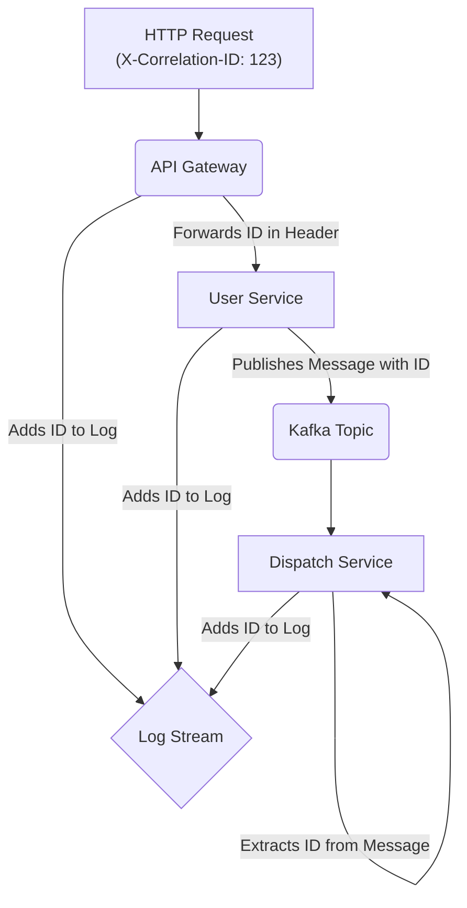

<p align="center">
  
</p>

<h1 align="center">SyntropyLog</h1>

<p align="center">
  <strong>The Observability Framework for High-Performance Teams.</strong>
  <br />
  Ship resilient, secure, and cost-effective Node.js applications with confidence.
</p>

<p align="center">
  <a href="https://github.com/Sintropyc/syntropylog/actions/workflows/ci.yml"></a>
  <a href="https://www.npmjs.com/package/syntropylog"></a>
  <a href="https://github.com/Sintropyc/syntropylog/blob/main/LICENSE"></a>
</p>

Modern applications are a complex web of microservices, third-party APIs, and message brokers. Logging is no longer about printing lines to the console; it's about navigating this complexity. **SyntropyLog** is more than just a logger; it's a comprehensive **observability and governance framework** built to tame this complexity.

It provides a powerful, unified solution that empowers developers, accelerates troubleshooting for tech leads, and gives managers peace of mind on security and costs.

---

## The SyntropyLog Advantage: A Framework for Every Role

<details>
<summary><strong>For the Developer: An Effortless Experience</strong></summary>

> "I just want to get my work done. I need tools that are simple, powerful, and don't get in my way."

-   **Fluent & Agnostic API**: Use a clean, unified API (`.getHttp()`, `.getBroker()`) for all your external communications. Switch from `axios` to `fetch` or from Kafka to RabbitMQ by changing one line in the configuration, not your application code.
-   **Zero Boilerplate**: The `correlationId` is propagated automatically. The logger is context-aware. You just call `logger.info()` and the hard work is done for you.
-   **Rich Testability**: With built-in mocks and spy transports, writing meaningful tests for your instrumentation is trivial, not a chore.

</details>

<details>
<summary><strong>For the Tech Lead: Instant, End-to-End Clarity</strong></summary>

> "When something breaks at 2 AM, I need to find the root cause in minutes, not hours. I need to see the whole story."

-   **Automatic Distributed Tracing**: SyntropyLog automatically injects and retrieves a `correlationId` across service boundaries. A single ID connects a user's request from your API gateway, through your services, and across your message queues.
-   **Structured & Actionable Logs**: All logs are JSON-structured for powerful querying. Contextual information (service name, HTTP method, broker topic) is added automatically, turning ambiguous log messages into clear, actionable data.



</details>

<details>
<summary><strong>For the Manager & DevOps: Ship with Confidence & Control</strong></summary>

> "I need to ensure our systems are secure, compliant, and cost-effective. Surprises are not an option."

-   **Declarative Log Scoping with Logging Matrix**: Stop paying to ingest verbose logs that you don't need. With the `loggingMatrix`, you can declaratively define *exactly* what parts of the context get logged for each severity level. Keep success logs lean and cheap, while capturing the full, rich context when an error occurs.
    ```typescript
    // In your config:
    loggingMatrix: {
      default: ['correlationId'], // Keep it minimal for info, debug, etc.
      error: ['*'],               // Log everything on error.
      fatal: ['*']
    }
    ```
-   **Automated Governance with Doctor CLI**: The `syntropylog doctor` is your automated gatekeeper for CI/CD. It validates configurations *before* deployment, preventing costly mistakes like overly verbose logging in production (saving on ingestion costs) or insecure setups.
-   **Tame Your ORMs with Custom Serializers**: Stop leaking data or polluting logs with massive objects. Define a serializer once for your `Prisma` or `TypeORM` models to ensure that only clean, safe data is ever logged.
-   **Security by Default**: A powerful, zero-dependency masking engine automatically finds and redacts sensitive data like `"password"` or `"creditCardNumber"` at any level of your log objects, ensuring you stay compliant.
</details>

---

## ⚡ Quick Start

This example shows how to initialize the logger and make an instrumented HTTP request.

```typescript
import { syntropyLog, PrettyConsoleTransport, AxiosAdapter } from 'syntropylog';
import axios from 'axios';

// 1. Configure SyntropyLog once in your application's entry point.
syntropyLog.init({
  logger: {
    level: 'info',
    serviceName: 'my-app',
    transports: [new PrettyConsoleTransport()], // Human-readable for dev
  },
  // Define what context gets logged. Keep it minimal by default, but verbose on error.
  loggingMatrix: {
    default: ['correlationId'],
    error: ['*'], // '*' means log the entire context
    fatal: ['*'],
  },
  context: {
    correlationIdHeader: 'X-Correlation-ID',
  },
  http: {
    instances: [
      {
        instanceName: 'myApi',
        adapter: new AxiosAdapter(axios.create({ baseURL: 'https://api.example.com' })),
      },
    ],
  },
});

// 2. Get the instrumented client and logger anywhere you need them.
const apiClient = syntropyLog.getHttp('myApi');
const logger = syntropyLog.getLogger();

// 3. Use them. The framework handles the rest.
async function main() {
    // Add extra data to the context for this specific operation
    syntropyLog.getContextManager().set('userId', 123);

    logger.info('Fetching user data...'); // Will only have `correlationId` in the context
    
    try {
      await apiClient.request({
        method: 'GET',
        url: '/users/1/posts',
      });
    } catch (err) {
      // This log will contain the full context, including `userId`, because the level is 'error'.
      logger.error({ err }, 'Failed to fetch posts');
    }
}

main();
```

---

## 📂 Learn by Example

The best way to learn SyntropyLog is to see it in action. We have a comprehensive collection of examples in the `/examples` directory.

Each example is a self-contained project that demonstrates a specific feature, from data masking to building a fully correlated full-stack application.

**[➡️ Explore the Examples](./examples/README.md)**
